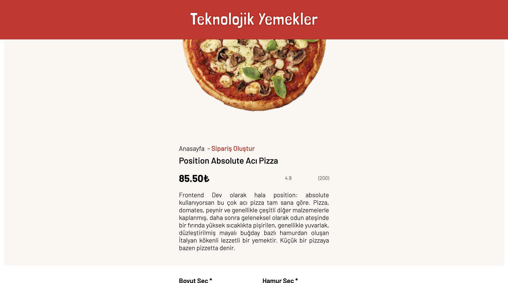
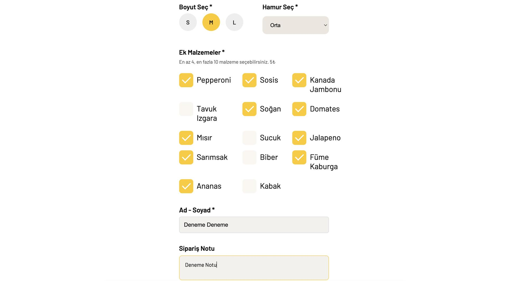
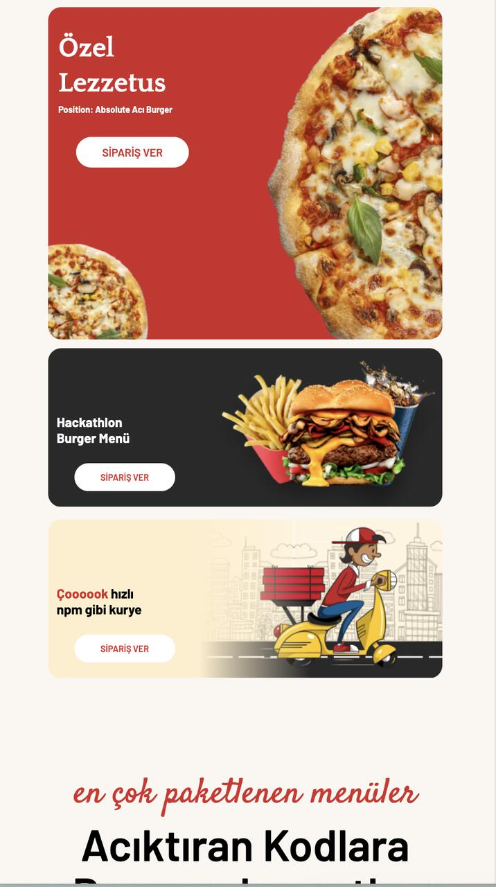

# 🍕 Pizza Order App

An interactive, user-friendly web application featuring a complex pizza ordering form with extensive selection logic, real-time input validation, dynamic price calculation, and End-to-End (E2E) testing.

## ✨ Features

- **Interactive Pizza Builder:** Multi-step pizza customization interface allowing users to select sizes, crust types, and a wide array of toppings based on Figma design specs.
- **Form Validation & Dynamic Pricing:** Real-time form validation ensuring data integrity (e.g., minimum topping selection limits, customer notes) with automatic price calculations.
- **End-to-End (E2E) Testing:** Complete user journey and edge cases thoroughly tested and verified using **Cypress**.
- **Responsive Layout:** Mobile-first, pixel-perfect design ensuring an optimal ordering experience across all device screens.

## 🛠️ Tech Stack

- **Frontend:** React.js, Vite
- **Styling:** CSS3 / Tailwind CSS
- **Testing:** Cypress
- **Deployment:** Vercel

## 📸 Ekran Görüntüleri / Screenshots

  
  

  
  

  
  

## ⚙️ Getting Started

### Prerequisites

Make sure you have Node.js installed on your machine.

### Installation & Execution

1. Clone the repository:
   git clone https://github.com/ggozdekocer/pizza-order-app.git
   cd pizza-order-app

2. Install dependencies:
   npm install

3. Run the development server:
   npm run dev

4. Launch Cypress E2E Tests:
   npx cypress open

## 👤 Author

- **Gözde Koçer** - [LinkedIn](https://linkedin.com/in/gozdekocer) • [GitHub](https://github.com/ggozdekocer)
